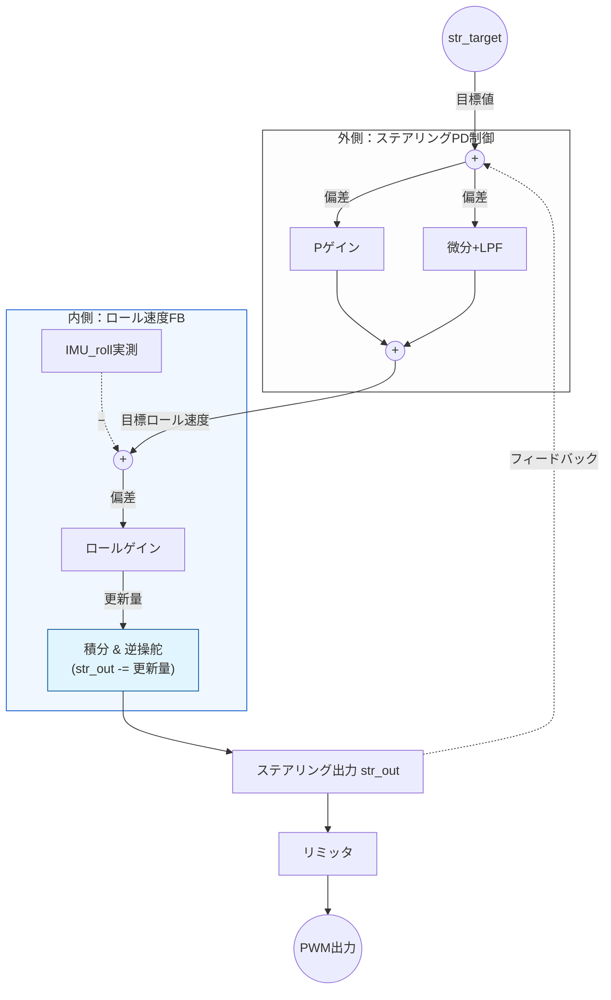

| Supported Targets | ESP32-C3 |
| ----------------- | -------- |

ROBOBIKE: Autonomous Self-Balancing Bicycle Robot  
Copyright 2026.05.05    Masayuki Tanaami      Mobile-Bot Lab. Japan  

ESP-IDF components and tools paths depend on installation location  

* Change Log  
```text
Date        CODE    DATA    Description
2026.05.26  1031       4    Chg: Servo PWM Rising Times. Lo-pass filter T
2026.05.19  1030    1022    Chg: Axis polarity inversion / No use GPIO Int. for Task
                            Dbg: Monitor.html  
2026.05.06  1029    1022    Chg: 3ms 1-shot soft timer -> 4ms espTimer / STR cmd Polarity +: left
                            Add: Ota, Data monitor.
                            Chg: esp-idf v5.4.1-->> v6.0.1
2026.04.07  1028    1022    Add: WiFi AP Ch. randomize
2026.03.31  1027    1021    Add: BACK cmd, SV EN Cont. heapless buffer
2026.03.20  1025    1021    Mov: GPIO definitions from servo.c to userdefine.h
2026.03.01  1024    1021    Add: IMU data API, 
                            Dbg: Calibration
2026.02.09  1023    1021    Add: Auto circling On/Off, restore SLEEP function
2026.01.20  1022    1021    Add: Speed buttons to control UI, add only_data
2026.01.17  1021    1021    Add: Auto circling
2026.01.11  1020    1020    The 1st release
2025.12.10  1017    1015    Ex1 step: converted to float (smooth side stand movement)
2025.11.29  1016    1015    Add: Steering slide bar
2025.11.11  1014    1014    Suppress UI scaling, add adjustment items, update stop sequence
2025.10.28  1011    1011    Update: Adjustment screen
```
* Control Logic
The ROBOBIKE utilizes a dual-loop control system: an outer steering PD loop and an inner roll rate feedback loop to achieve self-balancing via counter-steering.

## Control System Architecture


## Getting Started

This project is based on "Captive Portal Example".  
Development should be done using ESP-IDF v6.0  
Please install the ESP-IDF extension in VS-Code before building this project.  
  
* How to set up IntelliSense in VS Code:  
(1) Install the ESP-IDF Extension.  
(2) (Ctrl+Shift+P)Run the command "ESP-IDF: Add vscode configuration folder".  
(3) Perform a Build to generate necessary configuration files.  
-----------------------------------------------------------  
* Settings from menuconfig are saved to \project\sdkconfig  
* Change via menuconfig, KCONFIG Name:  
    Flash size : 4MB  
    Partition Table : Custom Partition Table CSV  
        CSV file : partitions.csv  
    configUSE_TRACE_FACILITY : checked  
    configGENERATE_RUN_TIME_STATS : checked  
* For debug with GDB, delete "launch.json"
        Full Clean
        Slelect Target to esp32c3 via USB JTAG
        Select COM port, Build and flash
        OpenOCD Server
        Sel "Eclipse CDT..."
-----------------------------------------------------------  
